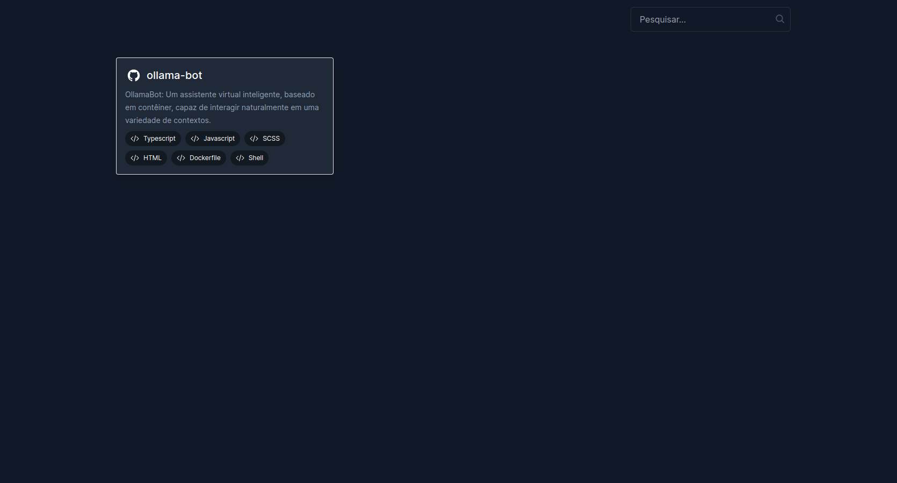

# DaBanda OSS 



**DaBanda-OSS** é uma plataforma desenvolvida em Next.js dedicada a promover e destacar projetos de código aberto de diversas áreas e temáticas.

Com uma interface intuitiva e moderna, DaBanda-OSS oferece uma maneira fácil e acessível de descobrir e contribuir para uma variedade de projetos de código aberto. Desde ferramentas de desenvolvimento até iniciativas de ciência de dados e software de código aberto, nossa plataforma conecta entusiastas, desenvolvedores e colaboradores, impulsionando a inovação e o compartilhamento de conhecimento.

## Configuração do Ambiente

#### 1. Clone o repositório:
```sh
git clone https://github.com/manuelbento19/dabanda-oss.git
```
***Att**: Certifique-se de ter o Docker e o Docker Compose instalados em seu sistema.*

#### 2. Instale as dependências:
**NPM**
```sh
    npm install
```
**Yarn**
```sh
    yarn add
```
  **Pnpm**
  ```sh
  pnpm install
  ```
#### 3. Rodar a Aplicação:
**NPM**
```sh
    npm run dev
```
**Yarn**
```sh
    yarn dev
```
  **Pnpm**
  ```sh
  pnpm dev
  ```
## Contribuição
Contribuições para o aprimoramento do **DaBanda** são bem-vindas! Sinta-se à vontade para abrir Issues ou enviar pull requests.

# Como Contribuir?
1. Faça **Fork** do repositório: para criar uma cópia do repositório em sua conta GitHub, clique no botão "Fork" no canto superior direito da página do repositório do projeto.

2. Clone o repositório bifurcado: para clonar o repositório em seu ambiente de desenvolvimento local, abra o terminal ou prompt de comando e execute o seguinte comando:
   **`git clone https://github.com/<username-github>/dabanda-oss.git`**

3. Instalar dependências: para instalar as dependências necessárias para o projeto, navegue até o diretório do projeto e execute o seguinte comando:
   **`npm install`**
4. Navegue até a pasta **`public/`** no diretório do seu projeto.

5. Abra o arquivo **`data.json`**.
6. Adicione o seguinte objeto JSON, substituindo os valores do espaço reservado pelos seus próprios detalhes:
   ```json
   {
        "name":"nome-do-projecto",
        "description":"descricao-do-projecto",
        "url":"url-do-projecto",
        "techs": ["array-de-tecnologias"]
    }
   ```
7. Salve o arquivo the **`data.json`** .
11. Crie uma nova branch: para criar uma nov branch, execute o seguinte comando:
    **`git checkout -b <nome-da-sua-branch>`**
12. Adicione seus arquivos alterados a área de stage executando o seguinte comando:
    **`git add .`**
13. Faça commit das suas alterações: Para salvar suas alterações na branch, execute o seguinte comando:
    **`git commit -m "add: <nome-da-sua-branch>"`**
14. Faça Push: para enviar as alterações para o repositório remoto, execute o seguinte comando:
    **`git push origin <nome-da-sua-branch>`**
15. Crie uma solicitação de Pull: para enviar suas alterações ao repositório principal, crie uma solicitação de pull clicando no botão "Comparar e solicitar Pull".
16. Aguarde a revisão: aguarde até que os mantenedores do projeto revisem e façam merge suas alterações.

Depois que suas alterações forem aceitas, a sua foto será exibida na lista de contribuidores do projeto.

## Contribuindo 👨‍💻

As contribuições tornam a comunidade de código aberto um lugar incrível para aprender, inspirar e criar.
<br>
**Qualquer contribuição que você fizer será verdadeiramente apreciada!**

<a id="contributors"></a>

## Contribuidores 🤝

<a href="https://github.com/manuelbento19/dabanda-oss/graphs/contributors">
  
</a>

<a id="license"></a>

## Licença

<table>
  <tr>
     <td>
       <p align="center"> </img>
    </td>
    <td> 
       <br> 
This project is licensed under <a href="./LICENSE">MIT</a>. 
    </td>
  </tr>
</table>

<a id="support"></a>

## Support 🙏

Obrigado por contribuir com nosso projeto de código aberto! Agradecemos seu apoio 🚀 <br>
Não se esqueça de deixar uma estrela ⭐